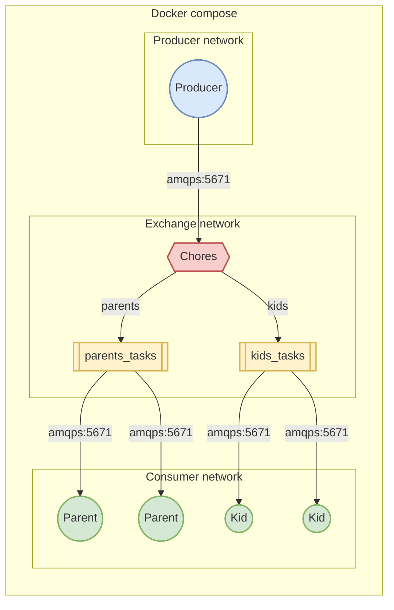

# RabbitMQ Playground

## Getting started

```bash
docker compose up --build
```

## Design


```mermaid
flowchart LR
    subgraph Docker compose
        subgraph Producer network
            P((Producer)):::P
        end

        subgraph Exchange network
            X{{Chores}}:::E
            Q1[[parents_tasks]]:::Q
            Q2[[kids_tasks]]:::Q
        end
        
        subgraph Consumer network
            C1((Parent)):::C
            C2((Parent)):::C
            C3((Kid)):::C
            C4((Kid)):::C
        end
    end

    P -- amqps:5671 --> X
    X -- parents --> Q1
    X -- kids --> Q2
    Q1 -- amqps:5671 --> C1 & C2
    Q2 -- amqps:5671 --> C3 & C4

    classDef P fill:#DAE8FC,stroke:#6C8EBF,stroke-width:2px
    classDef E fill:#F8CECC,stroke:#B85450,stroke-width:2px
    classDef Q fill:#FFF2CC,stroke:#D6B656,stroke-width:2px
    classDef C fill:#D5E8D4,stroke:#82B366,stroke-width:2px
```
