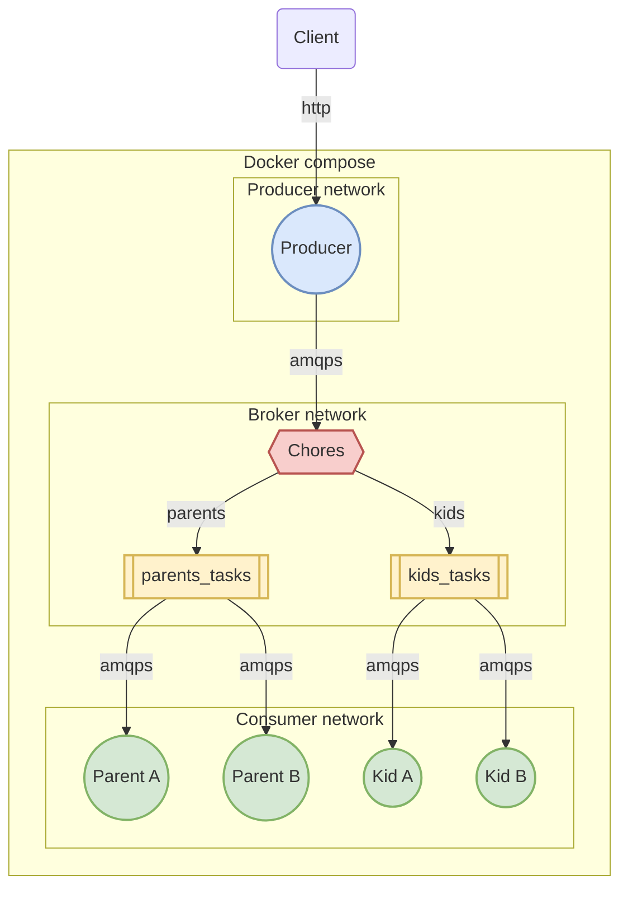

# RabbitMQ Experiments

This experiment demonstrates:

- Using the Pika library for Python to create a RabbitMQ client, used by producers and consumers
- Secure connections using mutual SSL authentication over TLS between three segregated networks
- A direct exchange with routing keys used to bind queues for consumers
- Multiple consumers receiving messages from shared queues using round-robin dispatching and prefetching, to parrallelise work
- Consumer Acknowledgements and Publisher Confirms for increased data safety
- Durable queues and persistent messages for increased fault tolerance
- Python type annotations and checking using mypy
- Container scaling using Docker Compose for local development

## Getting started

```bash
docker compose up --build
```

## Design


